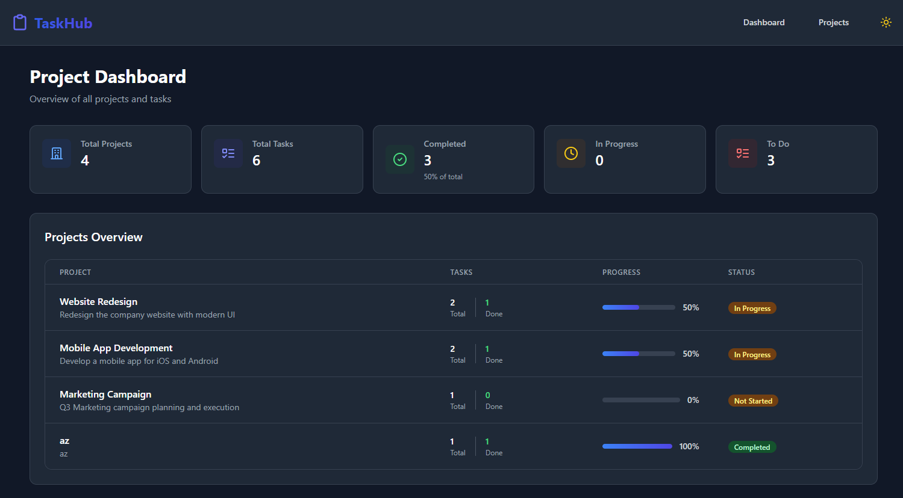
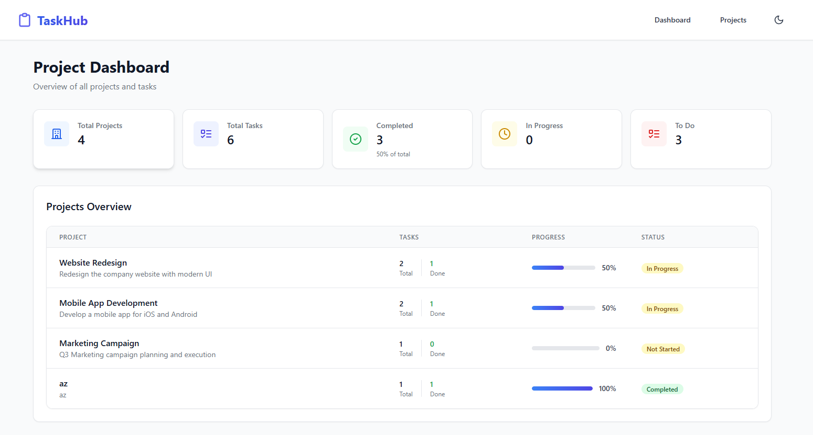
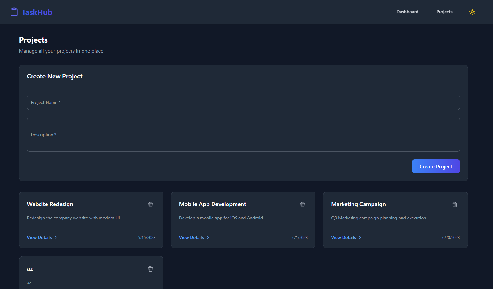
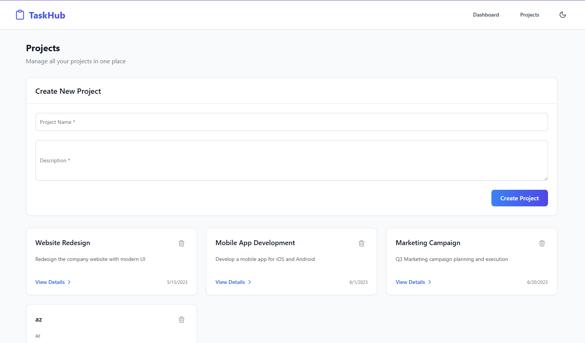
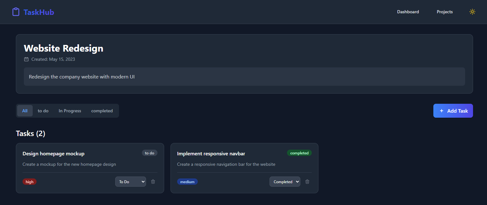
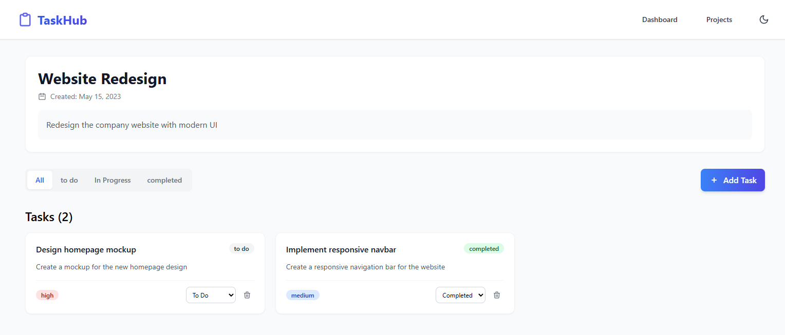
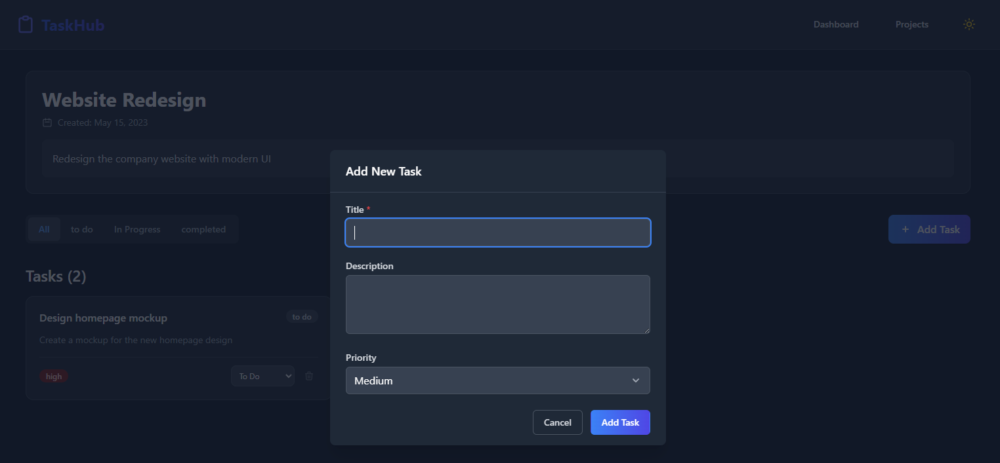
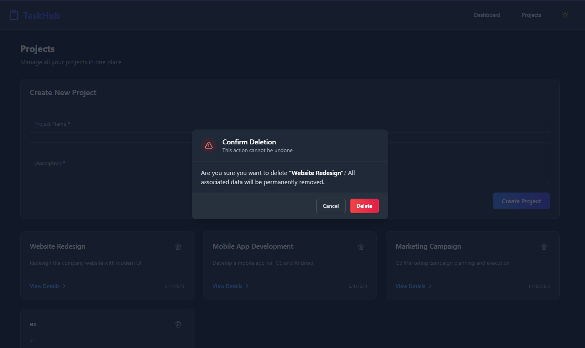

# TaskHub - Modern Project Management Dashboard

|  |  | 

TaskHub is a sleek project management application built with React, TypeScript, and Tailwind CSS, featuring a complete dark/light theme system.

## 📱 Screenshots

### Dashboard Views
| Dark Mode | Light Mode |
|-----------|------------|
|  |  |

### Projects Page
| Dark Mode | Light Mode |
|-----------|------------|
|  |  |

### Project Details
| Dark Mode | Light Mode |
|-----------|------------|
|  |  |

### Key Features
| Feature | Preview |
|---------|---------|
| Add Tasks |  |
| Delete Confirmation |  |

## ✨ Features

- **Full Theme Support**
  - System preference detection
  - Manual light/dark toggle
  - Persistent theme settings
  - Smooth transitions

- **Project Management**
  - Create/view/delete projects
  - Task status tracking (Todo/In Progress/Done)
  - Priority levels (High/Medium/Low)

- **Interactive UI**
  - Modern dashboard with statistics
  - Responsive design
  - Animated theme toggle
  - Confirmation dialogs

## 🛠️ Technologies

**Frontend**
- React 19 + TypeScript
- Redux Toolkit (State management)
- React Router 
- Tailwind CSS + Dark Mode
- Lucide Icons

**Backend**
- JSON Server (Mock API)
- RESTful endpoints

## 🚀 Getting Started

### Prerequisites
- Node.js v16 or higher
- a package manager (using npm for this example)

### Installation
1. Clone the repository:
   ```bash
   git clone https://github.com/your-username/taskhub.git
   cd taskhub
   ```

2. Install dependencies:
    ```bash
    npm install
    ```

3. Launch the mock API:
    ```bash
    npm run server:mock
    ```

4. (In a separate terminal) Start the development server:
    ```bash
    npm run dev
    ```